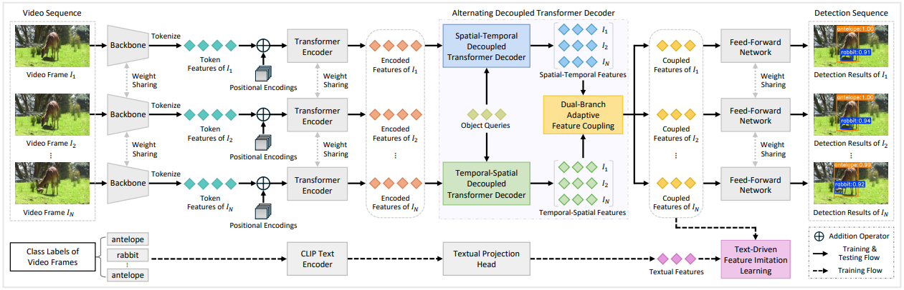

This repository is an official implementation of ADTI-Net.

**ADTI-Net is a standalone journal work published in IEEE Transactions on Image Processing (TIP). It is NOT the extended version of any conference paper.**

# ADTI-Net: Alternating Decoupled Transformer Imitation Network for Video Object Detection

<div align="center">  </div>

## Abstract

Recent advances in video object detection demonstrate that spatiotemporal feature aggregation has emerged as a dominant solution to boost detection performance. Most existing video object detection methods either employ unified learnable modules or follow a sequential spatial-to-temporal paradigm to conduct spatiotemporal feature aggregation, where their potential in modeling spatial and temporal contextual information has not been fully explored. Moreover, the feature aggregation procedure in existing methods potentially leads to feature collapse, which may cause false or missed detections. In this paper, we take a new alternating decoupling perspective on feature aggregation, and propose a novel Alternating Decoupled Transformer Imitation Network (ADTI-Net) for video object detection, with the goal of exploiting the alternating decoupling paradigm to fully model spatiotemporal contextual information while employing the imitation learning to effectively alleviate feature collapse. Specifically, we first develop an alternating decoupled transformer decoder module that alternately models spatial and temporal contextual information in a divide-and-conquer fashion, enabling our ADTI-Net to perform more effective and comprehensive feature aggregation. Second, we design a text-driven feature imitation learning module to enhance low-quality features that perplex classification under the supervision of high-quality features, making our ADTI-Net generate more discriminative feature representations. We conduct extensive experiments on the ImageNet VID and UAVDT datasets, and the results demonstrate that our ADTI-Net achieves state-of-the-art results and runs in real time on a single Nvidia A100 GPU. Particularly, our ADTI-Net achieves 88.1% mAP at a speed of 46.7 FPS with ResNet-101.

## Main Results


### Comparison on ImageNet VID

| Method | Backbone | Base Detector | mAP (%) | Runtime (ms) |
| :-----: | :------: | :-----------: | :-----: | :----------: |
| Deformable DETR (baseline) | ResNet-101 | Deformable DETR | 78.4 | – |
| CETR | ResNet-101 | Deformable DETR | 79.6 | – |
| CDANet | ResNet-101 | Deformable DETR | 85.4 | 80.6 |
| IMC-Det | ResNet-101 | Deformable DETR | 85.5 | 79.8 |
| TGBFormer | ResNet-101 | Deformable DETR | 86.5 | 24.3 |
| D2FANet | ResNet-101 | Deformable DETR | 87.7 | 24.6 |
| **ADTI-Net (Ours)** | ResNet-101 | Deformable DETR | **88.1** | **21.4** |
| **ADTI-Net (Ours)** | Swin-Base | Deformable DETR | **92.0** | 95.5 |

### Comparison on UAVDT

| Method | Backbone | mAP (%) | Runtime (ms) |
| :-----: | :------: | :-----: | :----------: |
| MaskVD | ResNet-101 | 44.0 | 27.1 |
| TGBFormer | ResNet-101 | 44.8 | 26.0 |
| **ADTI-Net (Ours)** | ResNet-101 | **45.9** | **23.2** |


## Updates

* (2026/09) Released the ADTI-Net source code.

## Installation

The codebase is built on top of [Deformable DETR](https://github.com/fundamentalvision/Deformable-DETR).

### Requirements

* Linux, CUDA 12.1, GCC>=10

* Python>=3.10

  We recommend using Anaconda to create a conda environment


* PyTorch>=2.1.2, torchvision>=0.16.2 (following instructions [here](https://pytorch.org/))


* Other requirements

  ```bash
  pip install -r requirements.txt
  ```

## Usage

### Dataset Preparation

ADTI-Net is evaluated on the widely used video object detection benchmark,
**ImageNet VID**. Download the ILSVRC2015 DET and ILSVRC2015 VID datasets from
[the official website](https://image-net.org/challenges/LSVRC/2015/2015-downloads),
and convert their annotations to the COCO-style JSON files (the conversion code
of [mmtracking](https://github.com/open-mmlab/mmtracking/tree/master/tools/convert_datasets/ilsvrc)
can be used). The joint annotation of the two datasets is used for training.

The expected directory structure is:

```text
code_root/
└── data/
    └── vid/
        ├── Data/
        |    ├── DET/
        |    └── VID/
        └── annotations/
             ├── imagenet_vid_train.json
             ├── imagenet_vid_train_joint_30.json
             └── imagenet_vid_val.json
```

Point `--vid_path` to this directory, or use symbolic links to place the datasets
under `datasets/`.

### Pretraining the Single-Frame Baseline

1. Download the COCO-pretrained weights from
   [Deformable DETR](https://github.com/fundamentalvision/Deformable-DETR) and
   put the checkpoint into:

```text
./exps/our_models/COCO_pretrained_model/
```

2. Train the single-frame baseline, which is used as the resume checkpoint of
   ADTI-Net:

```bash
GPUS_PER_NODE=4 ./tools/run_dist_launch.sh 4 configs/r101_train_single.sh
```

### Training ADTI-Net

Using the single-frame baseline weights as the resume model:

```bash
# 4 GPUs
GPUS_PER_NODE=4 ./tools/run_dist_launch.sh 4 configs/r101_train_adti.sh \
    --resume exps/our_models/exps_single/checkpoint.pth
```

ADTI-Net is trained end-to-end (no parameter freezing is applied). The
checkpoint is saved as `exps/adti_net/r101_adti_base/checkpoint.pth`.

### Evaluation

Evaluate ADTI-Net on the ImageNet VID validation set with N = 30 frames per
sequence:

```bash
GPUS_PER_NODE=4 ./tools/run_dist_launch.sh 4 configs/r101_eval_adti.sh
```

An ablation variant (e.g. without TFIL) can be evaluated by overriding the
corresponding coefficients on the command line, for instance
`--film_loss_coef 0` to disable the imitation loss of TFIL.

## Acknowledgement

This project is developed based on the following projects. We thank the authors
for releasing their code:

* [Deformable DETR](https://github.com/fundamentalvision/Deformable-DETR)
* [CLIP](https://github.com/openai/CLIP) (text encoder of the TFIL module)


